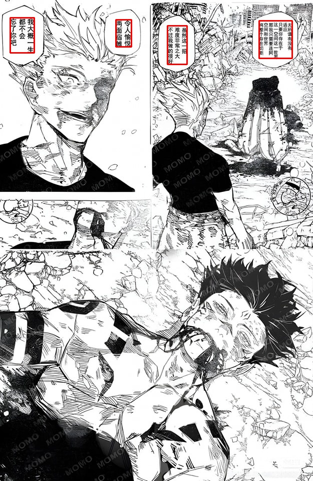
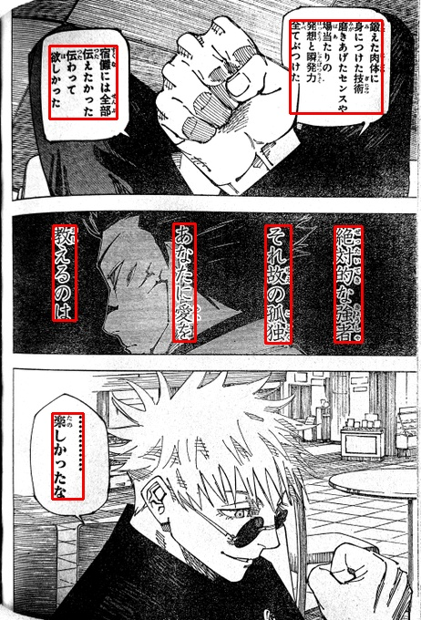
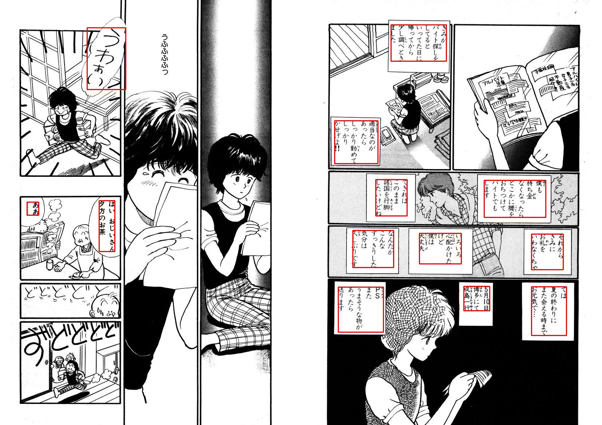

<h1>Box Chat Detection</h1> 

<h2>Bài toán xử lý là phát hiện các Box Chat của các nhân vật. </h2> 

Ở bài toán này chúng tôi sử dụng Yolov5 để detect Box Chat của các nhân vật, 
kết quả nhận được khá là tốt khi mà mAP của chúng tôi là 96.2%.

bạn có thể tải model <a href="https://drive.google.com/file/d/1GLfagjqg_j2uYPPXhSsMsKDuIWcKctdu/view?usp=drive_link">tại đây</a>

<h2>Hướng dẫn</h2>

sau khi clone github và tải model về thì hãy bỏ model vào thư mục static và chỉ cần nhấn run thôi

<h2>Cảm ơn </h2>

Project này được xây dựng từ những bộ dataset này:

<a href= http://www.manga109.org/en/download_s.html>Manga 109s</a>

